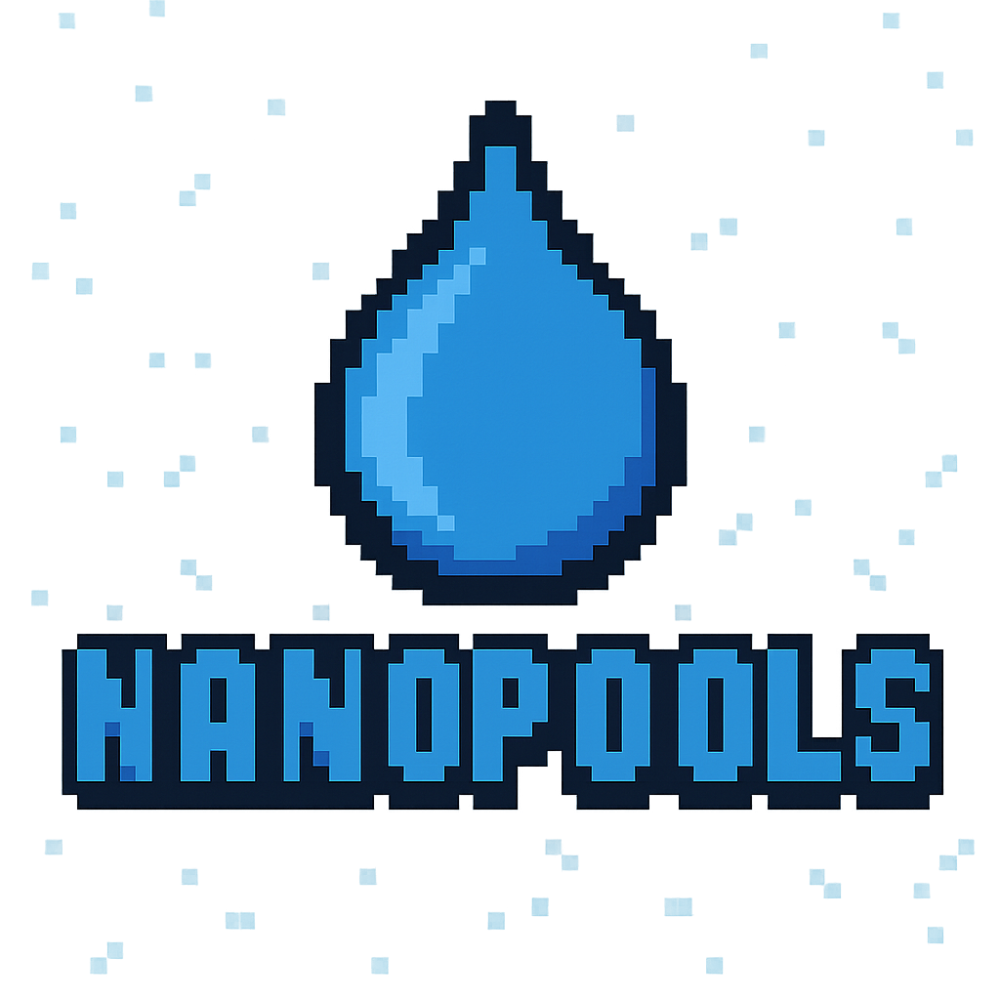
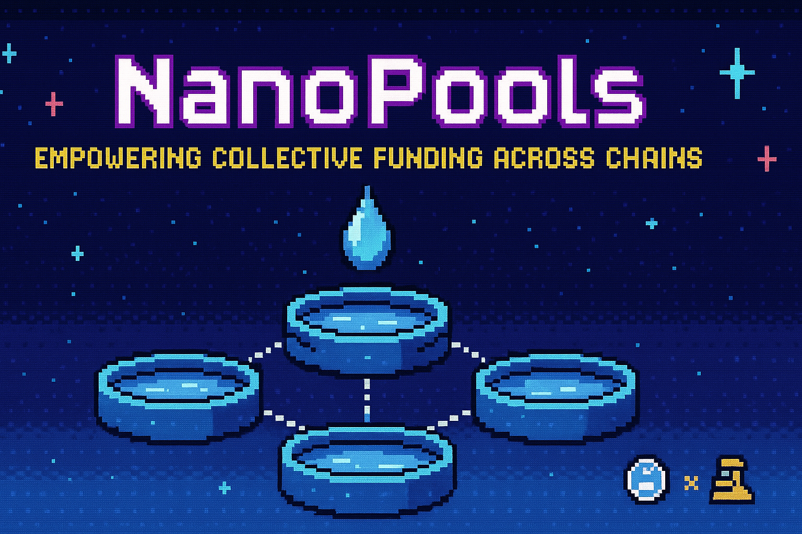

<div align="center">
  
  <h1>Pool Payments Protocol</h1>
  <p><strong>A multi-chain nanopooling protocol for small-scale payments and crowdfunding</strong></p>
  <p>
    <a href="#features">Features</a> •
    <a href="#architecture">Architecture</a> •
    <a href="#blockscout-integration">Blockscout</a> •
    <a href="#getting-started">Getting Started</a> •
    <a href="#networks">Networks</a> •
    <a href="#development">Development</a>
  </p>

  

  <p>
    <em>Created for ETHGlobal Prague 2025 Hackathon</em>
  </p>
</div>

<hr />

## 🚀 Introduction

The Pool Payments Protocol enables users to create and participate in small-scale payment pools across multiple blockchains with minimal gas fees. It provides a secure, transparent way to pool funds for various purposes, from group purchases to crowdfunding projects.

<details>
<summary><b>🏆 ETHGlobal Prague 2025 Bounties Targeted</b></summary>

- **⭐️ Best use of Blockscout**
- **📚 Best Blockscout SDK Integration**
- **🐹 Best Blockscout Merits Use Case**
- **💧 Big Blockscout Explorer Pool Prize**

</details>

<div align="center">
  
  
  
  
</div>

<br />

## ✨ Features

### 🌍 Multi-Chain Support
Deploy and interact with pools across Flow EVM, World Chain, and other EVM-compatible networks

### 💰 Nano Pooling
Create and participate in small-scale payment pools with minimal gas fees and transparent tracking

### 🔄 CREATE2 Deployment
Consistent contract addresses across chains for seamless multi-chain experience

### 🔍 Blockscout Explorer
Complete integration with Blockscout APIs, SDK, and Merits reward system

### 🔐 Secure Authentication
Sign in with Ethereum (SIWE) protocol via MiniKit for secure, decentralized auth

### 🎮 Gamified Experience
Earn Merits by creating pools, contributing, and completing funding goals

## 🏆 Deployment Achievements

### ✅ Flow EVM Testnet Integration Complete
- **Smart Contracts**: Successfully deployed using Hardhat Ignition
- **CREATE2 Factory**: Deterministic address deployment system
- **Blockscout Integration**: Ready for contract verification and Merit rewards
- **Sample Pool**: Test pool created and validated
- **Documentation**: Complete deployment records and guides

### 🔧 Technical Milestones
- **Hardhat 3.0**: Successfully configured with viem toolbox
- **Multi-chain Setup**: Flow EVM and World Chain network configurations
- **Deployment Automation**: Ignition modules for consistent deployments
- **Environment Management**: Configuration variables for secure key handling

<br />

## 🏗️ Architecture

The Pool Payments Protocol consists of several key components:

```
┌─────────────────┐      ┌─────────────────┐      ┌─────────────────┐
│                 │      │                 │      │                 │
│  Smart Contracts│      │  Frontend App   │      │   Blockscout    │
│                 │      │                 │      │   Integration   │
└────────┬────────┘      └────────┬────────┘      └────────┬────────┘
         │                        │                        │
         │                        │                        │
         ▼                        ▼                        ▼
┌─────────────────┐      ┌─────────────────┐      ┌─────────────────┐
│                 │      │                 │      │                 │
│    NanoPool     │◄────►│   Next.js UI    │◄────►│  REST/JSON-RPC  │
│                 │      │                 │      │      APIs       │
└─────────────────┘      └─────────────────┘      └─────────────────┘
         ▲                        ▲                        ▲
         │                        │                        │
         │                        │                        │
┌─────────────────┐      ┌─────────────────┐      ┌─────────────────┐
│                 │      │                 │      │                 │
│ Create2Factory  │      │   World App     │      │  Merit Rewards  │
│                 │      │   Integration   │      │     System      │
└─────────────────┘      └─────────────────┘      └─────────────────┘
```

### Core Components

1. **NanoPool Contract**: Secure Solidity contract for creating and managing funding pools
2. **CREATE2Factory**: Ensures consistent contract addresses across different chains
3. **Frontend App**: Next.js application with World App integration
4. **Blockscout Integration**: Complete explorer and Merit rewards system

<br />

## 🔍 Blockscout Integration

<details open>
<summary><b>🏆 Blockscout Features</b></summary>

### REST and JSON-RPC APIs
- Real-time transaction monitoring
- Contract data and verification
- Address tagging and watchlists

### React SDK Components
- Interactive UI with instant explorer feedback
- Real-time transaction status and confirmation
- TypeScript integration with full type safety

### Merit Rewards System
- Pool Creation: 20 Merits
- Pool Contribution: 5 Merits
- Pool Withdrawal: 2 Merits
- Pool Completion: 15 Merits

### Multi-Network Support
- Flow EVM Testnet (Chain ID: 545)
- World Chain Sepolia (Chain ID: 4801)

</details>

<br />

## 🚀 Getting Started

### Prerequisites

- Node.js 18+
- npm or Yarn
- MetaMask or World App wallet

### Installation

```bash
# Clone the repository
git clone https://github.com/ottodevs/nano-pools
cd nano-pools

# Install dependencies
npm install
npm run frontend:install

# Set environment variables
# Create a .env file with your RPC URLs and private keys

# Start the development server
npm run dev
```

### Deployment

#### ✅ Flow EVM Testnet (COMPLETED)
```bash
# Deploy using Hardhat Ignition (Hardhat 3.0)
export FLOW_EVM_TESTNET_RPC_URL="https://testnet.evm.nodes.onflow.org"
export FLOW_EVM_PRIVATE_KEY="0x..."

# Deploy CREATE2 Factory
npx hardhat ignition deploy ignition/modules/Create2Factory.ts --network flowEvmTestnet

# Deploy NanoPool with CREATE2
npx hardhat ignition deploy ignition/modules/NanoPoolWithCreate2.ts --network flowEvmTestnet

# Validate deployment
npx hardhat run scripts/validate-flow-deployment.ts --network flowEvmTestnet
```

#### 🔄 World Chain Sepolia (Pending)
```bash
# Deploy to World Chain Sepolia with Blockscout integration
npm run deploy:blockscout:world

# Verify CREATE2 addresses match across chains
npm run verify:addresses
```

#### 📊 Deployment Status
- ✅ **Flow EVM Testnet**: Deployed and validated
- 🔄 **World Chain Sepolia**: Pending deployment
- 🔄 **Cross-chain verification**: Pending World Chain deployment

<br />

## 🌐 Networks

| Network | Chain ID | Status | Explorer | API | Merits |
|---------|----------|--------|----------|-----|--------|
| Flow EVM Testnet | 545 | ✅ **DEPLOYED** | [Explorer](https://evm-testnet.flowscan.org) | [API](https://evm-testnet.flowscan.org/api) | ✅ |
| World Chain Sepolia | 4801 | 🔄 Pending | [Explorer](https://worldchain-sepolia.explorer.alchemy.com) | [API](https://worldchain-sepolia.explorer.alchemy.com/api) | ✅ |

### 🎯 Flow EVM Testnet Deployment (COMPLETED)

**Deployment Date**: June 1, 2025
**Deployment Method**: Hardhat Ignition (Hardhat 3.0)
**Status**: ✅ Successfully Deployed

#### 📋 Contract Addresses
| Contract | Address | Explorer Link |
|----------|---------|---------------|
| CREATE2 Factory | `0x20aD2b34860A7A44E548D4C740845A18C6753ba0` | [View Contract](https://evm-testnet.flowscan.org/address/0x20aD2b34860A7A44E548D4C740845A18C6753ba0) |
| NanoPool | `0xacAdfFE7D479c416C25509Cea6D36Bb797E34f29` | [View Contract](https://evm-testnet.flowscan.org/address/0xacAdfFE7D479c416C25509Cea6D36Bb797E34f29) |

#### 🔧 Network Configuration
- **RPC URL**: `https://testnet.evm.nodes.onflow.org`
- **Chain ID**: 545
- **Gas Price**: 1 gwei
- **Block Explorer**: https://evm-testnet.flowscan.org

#### 📁 Deployment Documentation
- **Deployment Record**: [`deployments/flow-evm-testnet.json`](./deployments/flow-evm-testnet.json)
- **Full Documentation**: [`deployments/flow-evm-testnet-deployment.md`](./deployments/flow-evm-testnet-deployment.md)

<br />

## 💻 Development

### Project Structure

```
├── contracts/                # Solidity smart contracts
│   ├── Create2Factory.sol    # Factory for consistent addresses
│   └── NanoPool.sol          # Main pool protocol contract
├── deploy/                   # Legacy deployment scripts (Hardhat 2.x)
├── deployments/              # ✅ Deployment records and documentation
│   ├── flow-evm-testnet.json # Flow EVM deployment record
│   └── flow-evm-testnet-deployment.md # Complete deployment docs
├── docs/                     # Documentation
├── frontend/                 # Next.js frontend application
│   ├── public/               # Static assets
│   └── src/                  # React components and hooks
├── ignition/                 # ✅ Hardhat Ignition deployment modules
│   └── modules/              # Deployment modules for Hardhat 3.0
│       ├── Create2Factory.ts # CREATE2 factory deployment
│       ├── NanoPool.ts       # Basic NanoPool deployment
│       └── NanoPoolWithCreate2.ts # NanoPool with CREATE2
├── scripts/                  # Utility and validation scripts
│   └── validate-flow-deployment.ts # Flow deployment validation
└── src/                      # Shared TypeScript code
    ├── components/           # React components
    ├── hooks/                # React hooks
    └── services/             # API services
```

### Commands

```bash
# Compile contracts
npm run compile

# Run tests
npm test

# Start development server
npm run dev

# Build for production
npm run build

# Deploy to Flow EVM testnet (Hardhat Ignition)
npx hardhat ignition deploy ignition/modules/Create2Factory.ts --network flowEvmTestnet
npx hardhat ignition deploy ignition/modules/NanoPoolWithCreate2.ts --network flowEvmTestnet

# Validate Flow EVM deployment
npx hardhat run scripts/validate-flow-deployment.ts --network flowEvmTestnet

# Legacy deployment commands (Hardhat 2.x style)
npm run deploy:blockscout:flow
npm run deploy:blockscout:world
```

<br />

## 📄 License

This project is licensed under the MIT License - see the LICENSE file for details.

<div align="center">
  <sub>Built with ❤️ for ETHGlobal Prague 2025</sub>
</div>

<!-- GitHub doesn't support style tags in markdown, so animations are applied through HTML/CSS in image tags -->
<div align="center">
  
</div>
